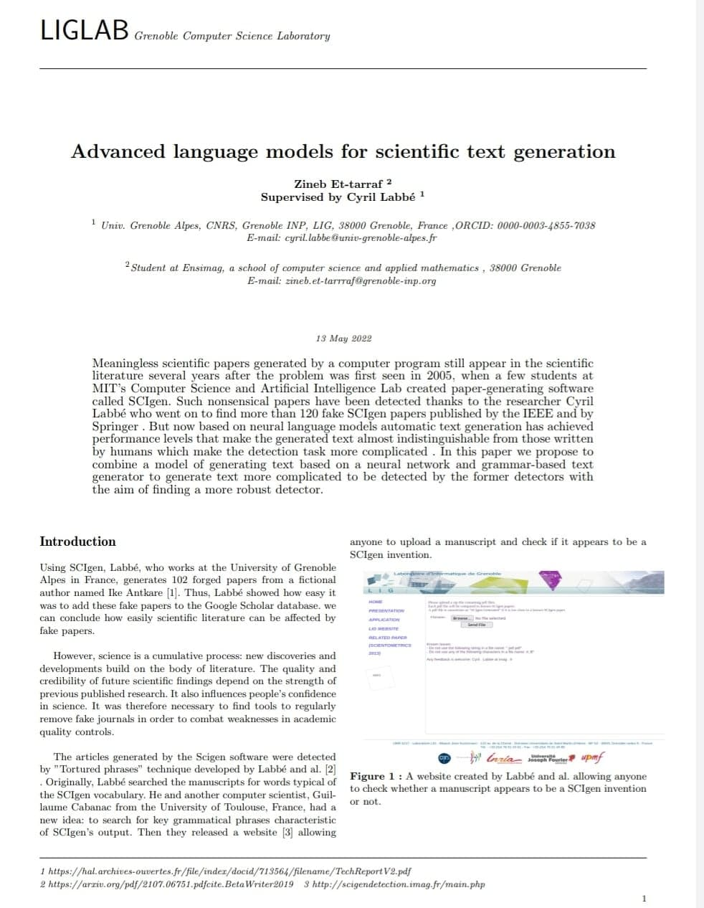
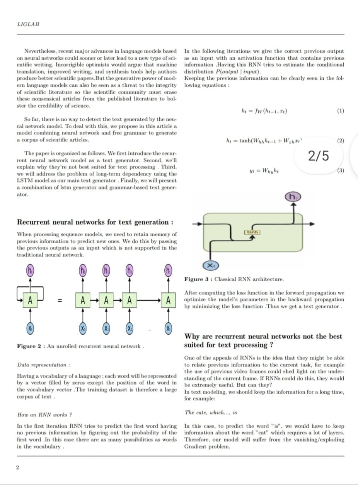
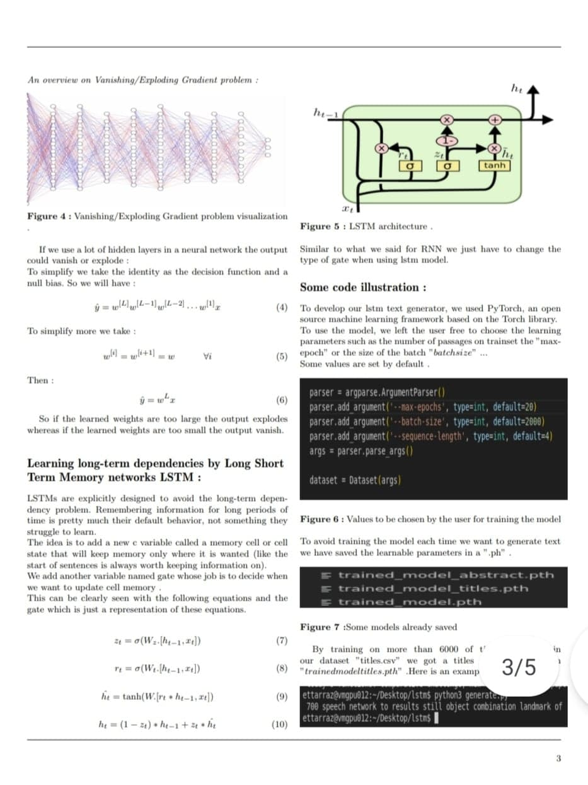
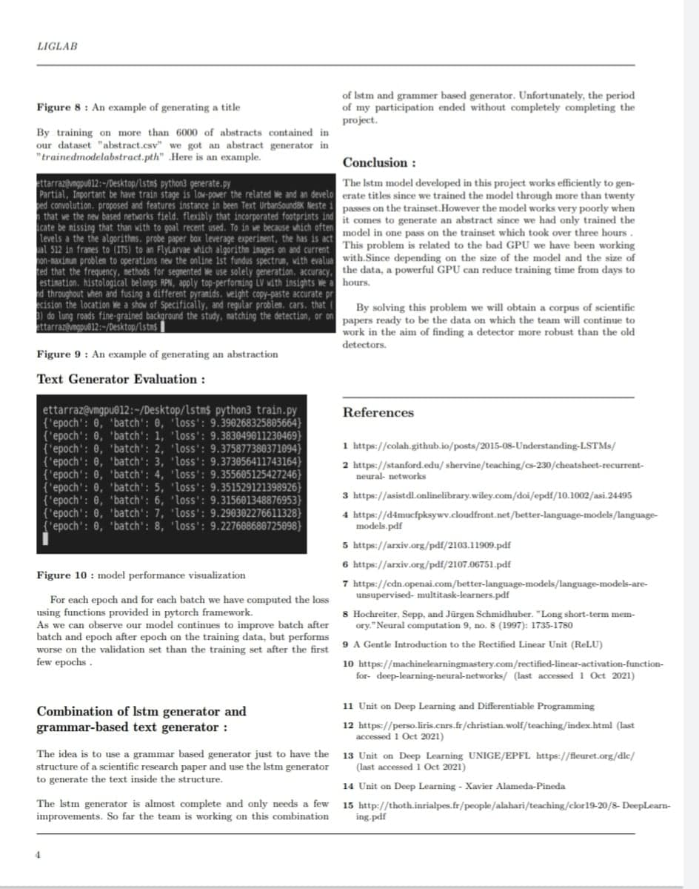
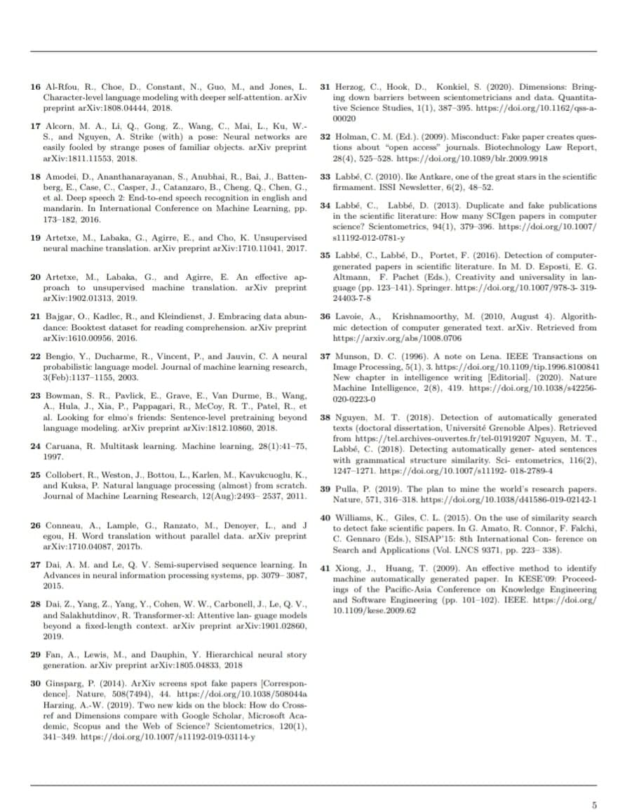

# Advanced language models for scientific text generation 

## Abstract 

Meaningless scientific papers generated by a computer program still appear in the scientific literature several years after the problem was first seen in 2005, when a few students at MIT’s Computer Science and Artificial Intelligence Lab created paper-generating software called SCIgen. Such nonsensical papers have been detected thanks to the researcher Cyril Labbe who went on to find more than 120 fake SCIgen papers published by the IEEE and by Springer . But now based on neural language models automatic text generation has achieved high levels that make the generated text almost indistinguishable from those written by humans which make the detection task more complicated .

## Objective 

In this project we propose to combine a model of generating text based on a neural network (LSTM model) and grammar-based text generator to generate scientific research paper more complicated to be detected by the former detectors with the aim of finding a more robust detector.

## Combination of lstm generator and grammar-based text generator

The idea is to use a grammar based generator just to have the structure of a scientific research paper and use the lstm generator to generate the text inside the structure.
The lstm generator is almost complete and only needs a few improvements. So far the team is working on this combination of lstm and grammer based generator. Unfortunately, the period of my participation ended without completely completing the project.

